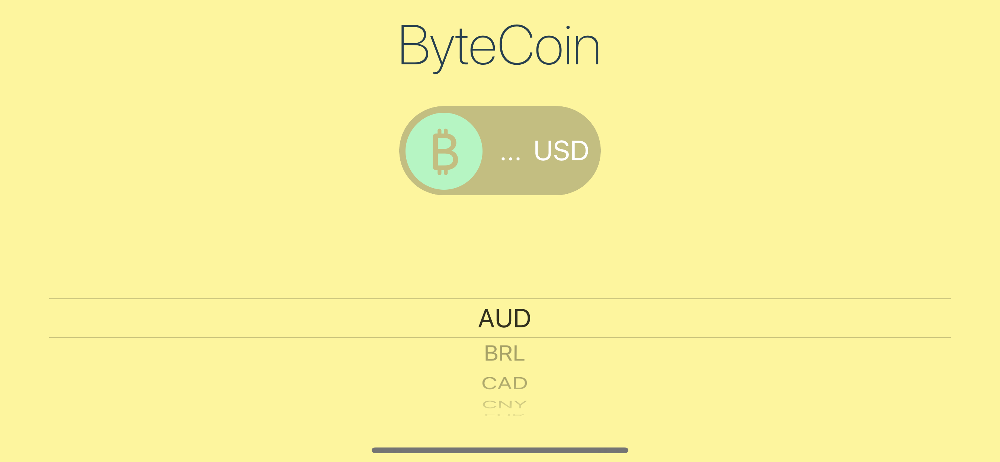
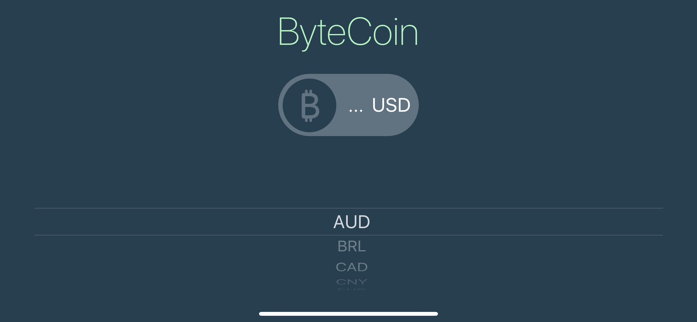

# Coins
This application is dark-mode enabled , it will get actual bitcoin exchange rates with real-time streaming data. Actual bitcoin exchange rate data source is coinapi.io API. This app was built following Angela's course on Udemy, but with some amendments.

<table>
 <tr>
    <td> • GIF </td>
    <td> • Landscape Shot 1 </td>
    <td> • Landscape Shot 2 </td>
  </tr> 
  <tr>
    <td> </td>
    <td></td>
    <td></td>
  </td>
  </tr>
